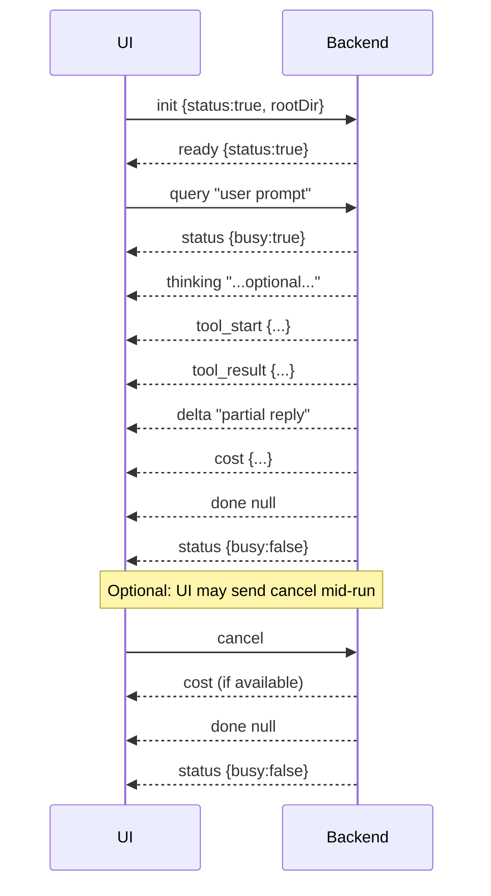

# Grepo NDJSON stdio protocol

Protocol between the **Ink UI** (Node/Bun) and the **Python backend**. One JSON object per line (NDJSON). Every message has exactly `type` and `value`.

## Conceptual overview

- **Transport:** Request–streamed–response over **stdio**. The UI starts the backend as a child process and connects to its stdin (write) and stdout (read). There is a single active conversation per backend process.
- **Message format:** Each line on stdin or stdout is exactly one JSON object: `{"type": "<event>", "value": <payload>}`. No other keys; the schema is the single source of truth (see [Schema and validation](#schema-and-validation)).
- **Statefulness:** The protocol is stateful within a process. The backend keeps agent state (e.g. context, compaction) across messages. A run is the span from one `query` until the corresponding `done` or `error` (and associated `status`/`cost`).

- **Stdin (UI → backend):** `init`, `query`, `set_thinking`, `cancel`
- **Stdout (backend → UI):** `ready`, `status`, `delta`, `done`, `error`, `tool_start`, `tool_result`, `thinking`, `cost`, `interrupt`

Schema: `protocol.schema.json` in this directory.

---

## Event flow

1. UI starts backend process; pipes stdin/stdout.
2. UI sends **init** with `{ status: true, rootDir }`.
3. Backend sends **ready** with `{ status: true }` when the agent is ready.
4. UI sends **query** (user message string) to run the agent.
5. Backend streams **status**, **delta**, **thinking**, **tool_start**, **tool_result**, then **cost** and **done**.
6. UI can send **set_thinking** (boolean) or **cancel** at any time.

### Sequence diagram (one run)



### Runs and concurrency

- **One query at a time.** The backend processes a single `query` until the run finishes (streaming ends with `done` or an `error`). The UI should not send another `query` until the current run has ended (i.e. after receiving `done` or `error` for that run). Sending a new `query` while a run is in progress is not specified; implementors should serialize runs.
- **No explicit run id.** A run is identified by the temporal span from one `query` to its corresponding `done` or `error`. Tool calls within a run are correlated by the **tool `id`**: each `tool_start` and its matching `tool_result` share the same `id`.

---

## Stdin events (UI → backend)

| type           | value        | description |
|----------------|-------------|-------------|
| `init`         | InitValue   | First message. `status: true`, `rootDir`: project path. |
| `query`        | string      | User message to run the agent. |
| `set_thinking` | boolean     | Turn extended thinking on/off. |
| `cancel`       | any         | Cancel the current run. |

- **init:** Sent once at startup, before any other message. Wait for **ready** before sending **query**.
- **query:** One per run. Send only after the previous run has ended (**done** or **error**).
- **set_thinking:** Optional; any time. Affects whether the backend emits **thinking** chunks (see [Thinking and status](#thinking-and-status)).
- **cancel:** Optional; only during a run (after **query**, before **done** or **error**).

### Example: init

```json
{"type":"init","value":{"status":true,"rootDir":"/path/to/project"}}
```

### Example: query

```json
{"type":"query","value":"Explain the main function in src/index.ts"}
```

### Example: set_thinking

```json
{"type":"set_thinking","value":true}
```

---

## Stdout events (backend → UI)

| type          | value          | description |
|---------------|----------------|-------------|
| `ready`       | ReadyValue     | Backend ready after init. `status: true`. |
| `status`      | StatusValue    | Agent state: `busy`, `thinking`, `compaction`. |
| `delta`       | string         | One chunk of assistant text (streaming). |
| `done`        | null           | End of streaming for this run. |
| `error`       | string         | Error message. |
| `tool_start`  | ToolStartValue | Tool call started: `id`, `name`, `args`, optional `data`. |
| `tool_result` | ToolResultValue| Tool finished: `id`, `name`, `content`, optional `format`. |
| `thinking`    | string         | One chunk of extended thinking (streaming). |
| `cost`        | CostValue      | Token usage and cost for the run. |
| `interrupt`   | InterruptValue | Reserved (e.g. edit approval); not yet used. |

- **ready:** Once after **init**. Indicates the backend is ready to accept **query**.
- **status:** At least at run start and end; may be sent during a run. Use `busy` to know if a run is in progress; `thinking` and `compaction` reflect optional/background state.
- **delta:** 0–N per run; ordered stream of assistant reply text between **query** and **done**.
- **done:** Exactly one per run; marks end of stream. Always sent after **cost** (if any) and before the final **status** for that run.
- **error:** 0–1 per run; terminal. Followed by **done** and **status** (see [Error behavior](#error-behavior)).
- **tool_start** / **tool_result:** 0–N per run; paired by `id`. Typically **tool_start** then **tool_result** for each call; ordering with **delta**/ **thinking** is backend-defined (e.g. tool_start after the deltas for the chunk that requested the tool).
- **thinking:** 0–N per run when extended thinking is on; streamed chunks of reasoning text (see [Thinking and status](#thinking-and-status)).
- **cost:** 0–1 per run; sent after streaming, before **done**.
- **interrupt:** Reserved; not currently sent.

### Thinking and status

- **set_thinking (stdin):** When the UI sends `set_thinking` with `true`, the backend enables extended thinking for the model; with `false`, it turns it off. The backend echoes the current value by sending **status** with `thinking: true` or `thinking: false`.
- **status.thinking (stdout):** Indicates whether extended thinking is currently enabled. It is updated on **set_thinking** and may appear in **status** messages during and after a run.
- **thinking (stdout):** When extended thinking is on, the backend may stream **thinking** events: each is one chunk of the model’s reasoning text. These are separate from **delta** (assistant reply). The UI can show them in a collapsible or secondary area. If extended thinking is off, no **thinking** events are sent.

### Example: ready

```json
{"type":"ready","value":{"status":true}}
```

### Example: status

```json
{"type":"status","value":{"busy":true,"thinking":false,"compaction":false}}
```

### Example: delta (streaming text)

```json
{"type":"delta","value":"Here is the "}
```

### Example: done

```json
{"type":"done","value":null}
```

### Example: tool_start

```json
{"type":"tool_start","value":{"id":"call_abc","name":"read","args":{"file_path":"src/index.ts"},"data":"src/index.ts"}}
```

### Example: tool_result (list_files)

```json
{"type":"tool_result","value":{"id":"call_abc","name":"list","content":[{"path":"src/index.ts","root":"/project","line":1}],"format":"list_files"}}
```

### Example: tool_result (grep)

```json
{"type":"tool_result","value":{"id":"call_xyz","name":"grep","content":[{"file":"src/foo.ts","line":42}],"format":"grep"}}
```

### Tool formats

The **tool_result** `format` field tells the UI how to interpret `content`. Implementations may send either `path` or `file` for file paths; the UI uses these to build clickable file links.

| format        | content shape | UI behavior |
|---------------|----------------|-------------|
| `list_files`  | Array of `{ path, root?, line? }` | Show as clickable file list. |
| `read_file`   | Array of `{ path, snippet?, root?, line? }` | Show file path and optional snippet. |
| `grep`        | Array of `{ file, line? }` or `{ path, line? }` | Show file:line search hits. |
| `glob`        | Array of `{ path, root?, line? }` | Same as list_files for display. |
| `code`        | String or array (code block) | Render as code. |
| `raw`         | String | Display as plain text. |
| `error`       | String | Display as error message. |

The authoritative shapes for message payloads are in `protocol.schema.json`; the schema’s `ToolResultValue` and its `format` enum define the allowed values.

### Example: cost

```json
{"type":"cost","value":{"total_input_tokens":1000,"total_output_tokens":200,"cost":"$0.012","context_window_used":"5%"}}
```

### Example: error

```json
{"type":"error","value":"Missing model API key. Set ANTHROPIC_API_KEY or add to .grepo/settings.json"}
```

### Cancel behavior

- **When:** The UI may send `cancel` after it has sent a `query` and before the backend has sent `done` or `error` for that run.
- **Effect:** The backend stops processing the current run as soon as it observes `cancel`. It then sends the same end-of-run sequence as for a normal completion: optionally **cost** (if computed), then **done**, then **status** with `busy: false`. The UI should treat this like a successful end of run (e.g. stop streaming UI, allow a new query) and may show that the run was cancelled if desired.

### Error behavior

- **When:** The backend sends `error` when something goes wrong (e.g. missing API key, invalid message, exception during a run).
- **Effect:** An `error` ends the current run. The backend still sends **done** and **status** (`busy: false`) after an `error`, and may send **cost** if applicable. The UI should treat `error` as terminal for that run: show the error message to the user, stop expecting further `delta`/tool events for that run, and wait for `done`/`status` before allowing a new query.

---

## Value structures (reference)

- **InitValue:** `{ status: boolean, rootDir: string }`
- **ReadyValue:** `{ status: boolean }`
- **StatusValue:** `{ busy?: boolean, thinking?: boolean, compaction?: boolean }`
- **ToolStartValue:** `{ id: string, name: string, args: object, data?: string | null }`
- **ToolResultValue:** `{ id: string, name: string, content: string | array, format?: "list_files"|"read_file"|"grep"|"glob"|"code"|"raw"|"error" }`
- **CostValue:** `{ total_input_tokens, total_output_tokens, cost: string, context_window_used: string, ... }`
- **InterruptValue:** `{ old_code?: string, new_code?: string }`

Tool `content` array items can be: a string; `{ path, snippet?, root?, line? }` (read_file/list_files/glob); or `{ file, line? }` (grep). The UI uses `path`/`root`/`line` to build clickable file links.

---

## Schema and validation

- **protocol.schema.json** in this directory is the **single source of truth** for the JSON shape of every message (stdin and stdout). Each line is a single JSON object that must conform to either `StdinMessage` or `StdoutMessage` in that schema.
- **Use in tests/tooling:** You can validate messages produced by the UI or backend against this schema (e.g. with a JSON Schema validator) to catch protocol drift.
- **Types:** The UI uses TypeScript types and runtime guards in `protocol.ts` that mirror the schema; the backend uses the same message shapes. You can generate types from the schema (e.g. for other languages) if you add a codegen step.

---

## Implementor checklist

- Send **init** first, then wait for **ready** before sending **query**.
- For each run: send one **query**, then handle **status**, **delta**, **thinking**, **tool_start**, **tool_result**, **cost**, and **done** in order (see [Stdout events](#stdout-events-backend--ui)).
- Handle **error** as terminal for that run: show the message, then wait for **done** and **status** before starting a new run.
- Optionally send **set_thinking** and **cancel** as needed; see [Thinking and status](#thinking-and-status) and [Cancel behavior](#cancel-behavior).
- Validate messages against **protocol.schema.json** in development or tests to stay in sync with the spec.
